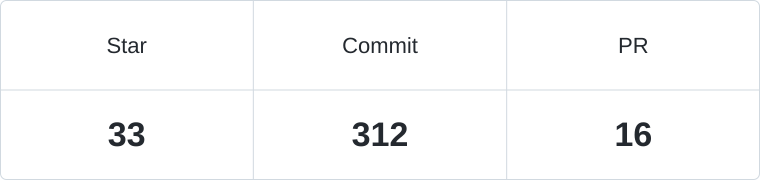

<h1 align="center">你好，我是 lysheon 👋</h1>

AI Agent · 后端开发 · Python & Go

<a href="README.md">English</a>

我用 Python 和 Go 开发 AI Agent 与后端服务，关注 RAG、工具调用和大模型工作流，让模型能够调用工具、融入实际应用。

### 技术栈

`Python` · `Go` · `TypeScript` · `SQL` · `Docker` · `Linux`

### 精选项目

- [AIOps_Agent](https://github.com/lysheon/AIOps_Agent) — 面向运维与诊断的 AI 助手，结合 RAG 知识库与对话工作流。
- [minicode-python](https://github.com/lysheon/minicode-python) — 用 Python 实现的终端编程 Agent。
- [Develop-a-WeChat-like-app](https://github.com/lysheon/Develop-a-WeChat-like-app) — 基于 Go、React 和 TypeScript 的全栈聊天应用，集成 Eino AI 助手。

  

